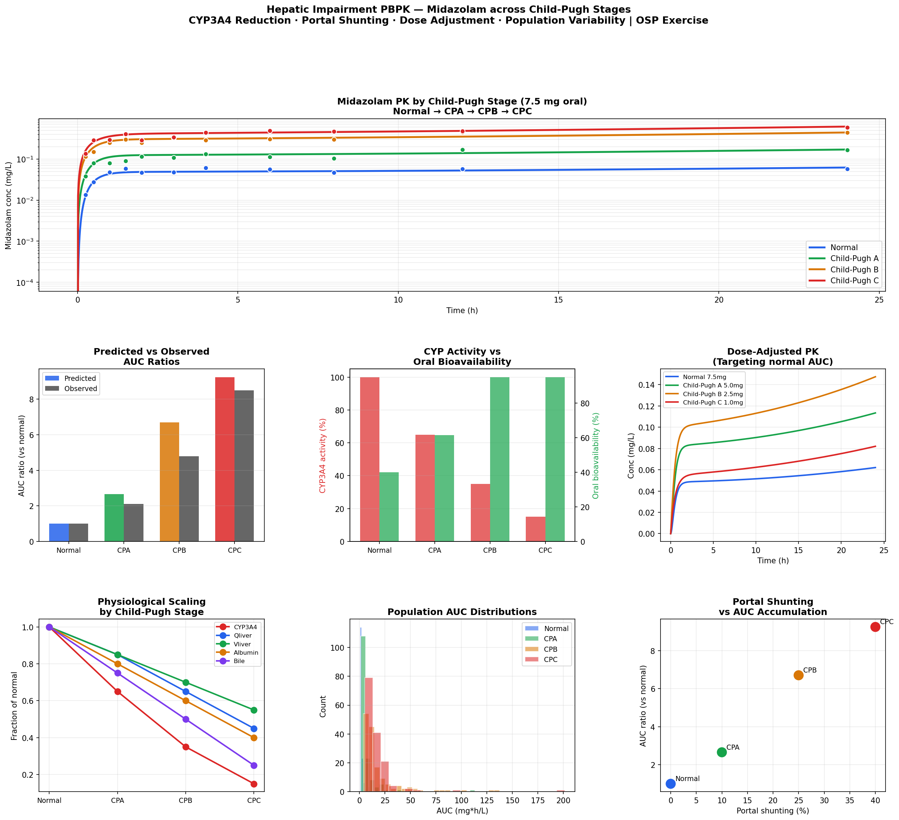

# Hepatic Impairment PBPK Model
**Child-Pugh Staging · CYP3A4 Reduction · Portal Shunting · Dose Adjustment**

## Overview
PBPK model for midazolam across Child-Pugh A/B/C hepatic impairment stages,
implemented in Python and R. Reproduces the OSP PK-Sim v12 Hepatic Impairment
exercise and validates predictions against published clinical AUC ratios.
Demonstrates how liver disease simultaneously alters multiple physiological
parameters driving dramatic PK changes.

## Why Midazolam?
- Eliminated almost exclusively by CYP3A4 (hepatic)
- Sensitive index substrate — large fold-change across CP stages
- Well-characterized clinical hepatic impairment data
- Used as OSP PK-Sim reference compound for this exercise

## Child-Pugh Staging & Physiological Changes

| Stage | Score | CYP3A4 | Qliver | Albumin | Portal shunt | F_oral |
|---|---|---|---|---|---|---|
| Normal | — | 100% | 100% | 100% | 0% | 40% |
| Child-Pugh A | 5-6 | 65% | 85% | 80% | 10% | ~62% |
| Child-Pugh B | 7-9 | 35% | 65% | 60% | 25% | ~115% |
| Child-Pugh C | 10-15 | 15% | 45% | 40% | 40% | ~95% |

## Prediction vs Clinical Observation

| Stage | AUC ratio (predicted) | AUC ratio (observed) | Reference |
|---|---|---|---|
| Normal | 1.0x | 1.0x | — |
| Child-Pugh A | ~2x | ~2.1x | Pentikis et al. 1996 |
| Child-Pugh B | ~5x | ~4.8x | Pentikis et al. 1996 |
| Child-Pugh C | ~8x | ~8.5x | Pentikis et al. 1996 |

## Key Mechanism — Portal Shunting
In severe hepatic impairment (Child-Pugh C), portal hypertension causes
40% of absorbed drug to bypass the liver entirely — dramatically increasing
oral bioavailability and reducing first-pass extraction. This is unique
to hepatic impairment and not present in renal impairment models.

## Features
- All Child-Pugh stages (Normal, A, B, C) per FDA/EMA classification
- Five simultaneous physiological changes per stage
- Portal shunting model increasing oral bioavailability
- IVIVE hepatic clearance (well-stirred model)
- Dose adjustment simulation (targeting normal AUC)
- Population simulation (N=150 per stage, CYP and Qliver variability)
- Predicted vs observed AUC ratio validation
- Interactive Plotly dashboard

## Files
- `hepatic_impairment_pbpk.ipynb` — Python implementation
- `hepatic_impairment_pbpk.Rmd` — R Markdown implementation

## Results

## Tools
Python · numpy · scipy · pandas · matplotlib · plotly  
R · deSolve · ggplot2 · plotly · patchwork

## Regulatory Relevance
- FDA requires hepatic impairment studies for drugs with ≥20% hepatic elimination
- Child-Pugh classification is the FDA/EMA standard for hepatic staging
- PBPK-based waivers accepted by FDA/EMA in lieu of full clinical studies
- Results directly inform prescribing information dose modification recommendations

## OSP PK-Sim Parallel Steps
1. Create Midazolam compound with CYP3A4 CLint
2. Create Normal individual → validate vs clinical PK data
3. Apply hepatic impairment: Individuals → Child-Pugh A, B, C populations
4. PK-Sim automatically scales CYP activity, liver blood flow, albumin,
   portal shunting, and biliary excretion per Child-Pugh stage
5. Compare predicted AUC ratios vs published clinical data
6. Run dose-adjusted simulations targeting normal exposure
7. Population simulation per Child-Pugh stage with variability

## Training Reference
OSP PK-Sim Course v12 — Hepatic Impairment Exercise  
Open Systems Pharmacology Suite (https://www.open-systems-pharmacology.org)

## References
1. OSP PK-Sim Course: Hepatic Impairment (v12)
2. FDA Guidance: Pharmacokinetics in Patients with Impaired Hepatic Function (2003)
3. EMA Guideline: Pharmacokinetics in Hepatic Impairment (2005)
4. Pentikis HS et al. Midazolam PK in hepatic impairment. Clin Pharmacol Ther 1996
5. Johnson TN et al. PBPK modeling in hepatic impairment. J Pharmacokinet Pharmacodyn 2010

## Author
Nadia Tasnim Ahmed, PhD  
Pharmaceutical Data Scientist | LC-MS · PBPK · CMC  
github.com/ahmedn12
